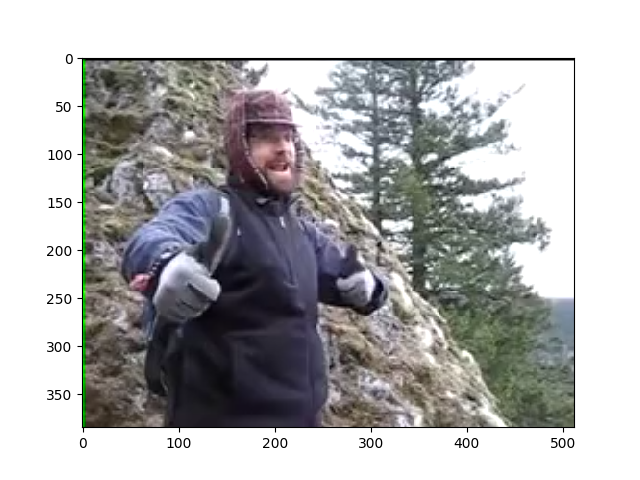

PyNVVL
======
[](https://pypi.org/project/pynvvl-cuda80)
[](https://pypi.org/project/pynvvl-cuda90)
[](https://pypi.org/project/pynvvl-cuda91)
[](https://github.com/mitmul/pynvvl)

PyNVVL is a thin wrapper of [NVIDIA Video Loader (NVVL)](https://github.com/NVIDIA/nvvl). This package enables you to load videos directoly to GPU memory and access them as [CuPy](https://github.com/cupy/cupy) ndarrays with zero copy. The pre-built binaries of PyNVVL include NVVL itself, so you do not need to install NVVL.

## Requirements

- CUDA 8.0, 9.0, or 9.1
- Python 2.7.6+, 3.4.7+, 3.5.1+, or 3.6.0+
- [CuPy](https://github.com/cupy/cupy) v4.0.0

## Tested Environment

- Ubuntu 16.04
- Python 2.7.6+, 3.4.7+, 3.5.1+, and 3.6.0+
- CUDA 8.0, 9.0, and 9.1

## Install the pre-built binary

Please choose a right package depending on your CUDA version.

```bash
# [For CUDA 8.0]
pip install pynvvl-cuda80

# [For CUDA 9.0]
pip install pynvvl-cuda90

# [For CUDA 9.1]
pip install pynvvl-cuda91
```

## Usage

```python
import pynvvl
import matplotlib.pyplot as plt

# Create NVVLVideoLoader object
loader = pynvvl.NVVLVideoLoader(device_id=0)

# Show the number of frames in the video
n_frames = loader.frame_count('examples/sample.mp4')
print('Number of frames:', n_frames)

# Load a video and return it as a CuPy array
video = loader.read_sequence(
    'examples/sample.mp4',
    horiz_flip=True,
    crop_y=30,
    crop_height=190,
    scale_method='Nearest',
    normalized=True
)

print(video.shape)  # => (91, 3, 256, 256): (n_frames, channels, height, width)
print(video.dtype)  # => float32

# Get the first frame as numpy array
frame = video[0].get()
frame = frame.transpose(1, 2, 0)

plt.imshow(frame)
plt.savefig('examples/sample.png')
```



This video is `flickr-2-6-3-3-5-2-7-6-5626335276_4.mp4` from the Moments-In-Time dataset.

## Transformation Options

`pynvvl.NVVLVideoLoader.read_sequence` can take some options to specify the color space, the value range, and what transformations you want to perform to the video.

```
Loads the video from disk and returns it as a CuPy ndarray.

    Args:
        filename (str): The path to the video.
        frame (int): The initial frame number of the returned sequence.
            Default is 0.
        count (int): The number of frames of the returned sequence.
            If it is None, whole frames of the video are loaded.
        channels (int): The number of color channels of the video.
            Default is 3.
        scale_height (int): The height of the scaled video.
            Note that scaling is performed before cropping.
            If it is 0 no scaling is performed. Default is 0.
        scale_width (int): The width of the scaled video.
            Note that scaling is performed before cropping.
            If it is 0, no scaling is performed. Default is 0.
        crop_x (int): Location of the crop within the scaled frame.
            Must be set such that crop_y + height <= original height.
            Default is 0.
        crop_y (int): Location of the crop within the scaled frame.
            Must be set such that crop_x + width <= original height.
            Default is 0.
        crop_height (int): The height of cropped region of the video.
            If it is None, no cropping is performed. Default is None.
        crop_width (int): The width of cropped region of the video.
            If it is None, no cropping is performed. Default is None.
        scale_method (str): Scaling method. It should be either of
            'Nearest' or 'Lienar'. Default is 'Linear'.
        horiz_flip (bool): Whether horizontal flipping is performed or not.
            Default is False.
        normalized (bool): If it is True, the values of returned video is
            normalized into [0, 1], otherwise the value range is [0, 255].
            Default is False.
        color_space (str): The color space of the values of returned video.
            It should be either 'RGB' or 'YCbCr'. Default is 'RGB'.
        chroma_up_method (str): How the chroma channels are upscaled from
            yuv 4:2:0 to 4:4:4. It should be 'Linear' currently.
```

## How to build wheels

### Requirements for build

- Docker
- nvidia-docker (v1/v2)

```
bash docker/build_wheels.sh
```
